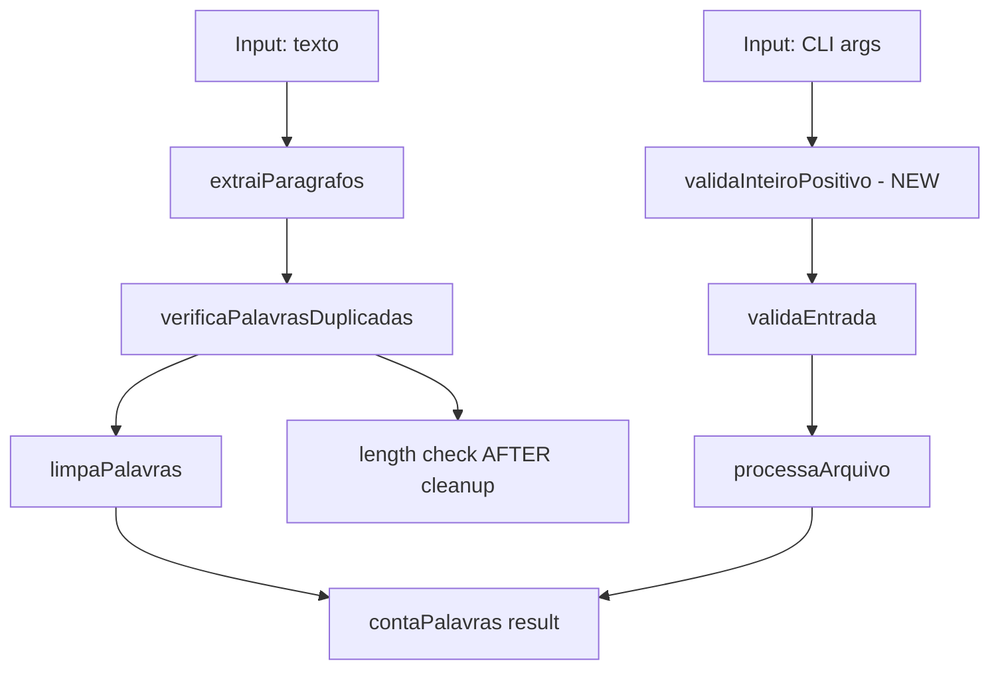

# Bug Fixes Design

**Spec**: `.specs/features/bug-fixes/spec.md`
**Status**: Draft

---

## Architecture Overview

The bug fixes are **localized changes** — no new modules, no new dependencies, no architectural changes. The fix strategy is:

1. Fix core logic in `index.ts` (bugs B1/B2, B3, regex PT-BR)
2. Fix CLI validation in `cli.ts` (NaN handling)
3. Update existing tests to match new behavior
4. Add new tests for edge cases

**Key change**: The flow stays the same. The difference is WHERE the length check happens (after `limpaPalavras` instead of before) and HOW splitting/validation works.

---

## Code Reuse Analysis

### Existing Components to Leverage

| Component | Location | How to Use |
|-----------|----------|------------|
| `limpaPalavras` | `src/index.ts:28` | Keep as-is, just expand regex |
| `contaPalavras` | `src/index.ts:4` | Modify internal logic, keep signature |
| `extraiParagrafos` | `src/index.ts:21` | Change split regex, keep signature |
| `validaEntrada` | `src/cli.ts:75` | Keep as-is (async refactor is out of scope) |
| `trataErros` | `src/erros/funcoesErro.ts` | Keep as-is |
| Test utilities | `src/__tests__/cli.test.ts` | Reuse mocking patterns for new tests |

### Integration Points

| System | Integration Method |
|--------|-------------------|
| `contaPalavras` | Called by `cli.ts:processaArquivo` — signature unchanged |
| `montaSaidaArquivo` | Called by `cli.ts:criaESalvaArquivo` — signature unchanged |
| `validaEntrada` | Called by `cli.ts` action — will add `validaInteiroPositivo` before it |

---

## Components

### Component 1: `limpaPalavras` (modify)

- **Purpose**: Remove punctuation from words, now including PT-BR characters
- **Location**: `src/index.ts:28-31`
- **Interfaces**: `limpaPalavras(palavra: string): string` — unchanged
- **Dependencies**: None
- **Reuses**: Existing regex pattern, expanded with unicode escapes

**Change**: Expand regex to cover `\u2014` (em-dash), `\u2013` (en-dash), `\u2026` (ellipsis), `\u201C`/`\u201D` (curly double quotes), `\u2018`/`\u2019` (curly single quotes), `[`, `]`, `\`, `^`.

### Component 2: `verificaPalavrasDuplicadas` (modify)

- **Purpose**: Count word occurrences per paragraph, now with correct length check order
- **Location**: `src/index.ts:36-51`
- **Interfaces**: Same signature
- **Dependencies**: `limpaPalavras`
- **Reuses**: Existing logic

**Change**: 
1. Split with `/\s+/` instead of `' '`
2. Move `limpaPalavras` call BEFORE length check
3. Skip empty strings after cleaning
4. Check `palavraLimpa.length` instead of `palavra.length`

### Component 3: `extraiParagrafos` (modify)

- **Purpose**: Split text into paragraphs, now handling CRLF/CR
- **Location**: `src/index.ts:21-23`
- **Interfaces**: Same signature
- **Dependencies**: None
- **Reuses**: Existing logic

**Change**: Replace `split('\n')` with `split(/\r?\n/)` and filter empty paragraphs.

### Component 4: `validaInteiroPositivo` (new)

- **Purpose**: Validate that CLI numeric options are positive integers
- **Location**: `src/cli.ts` (new function, before `buildProgram`)
- **Interfaces**: `validaInteiroPositivo(valor: string, nome: string): number`
- **Dependencies**: `chalk` (already imported)
- **Reuses**: Error display pattern from `validaEntrada`

**Behavior**:
- Parse with `parseInt(valor, 10)`
- If `NaN` or `<= 0`: log error with `chalk.red` and `process.exit(1)`
- Otherwise return parsed number

### Component 5: CLI action handler (modify)

- **Purpose**: Replace bare `parseInt` calls with `validaInteiroPositivo`
- **Location**: `src/cli.ts:52-53`
- **Interfaces**: None (internal change)
- **Dependencies**: `validaInteiroPositivo`
- **Reuses**: Existing action handler structure

---

## Error Handling Strategy

| Error Scenario | Handling | User Impact |
|---------------|----------|-------------|
| `--min-chars abc` | `validaInteiroPositivo` → exit(1) with error message | Clear error: "min-chars deve ser um número inteiro positivo" |
| `--min-chars -1` | `validaInteiroPositivo` → exit(1) with error message | Clear error: "min-chars deve ser um número inteiro positivo" |
| `--min-chars 0` | `validaInteiroPositivo` → exit(1) with error message | Clear error: "min-chars deve ser um número inteiro positivo" |
| Empty string after cleanup | Silently skip in `verificaPalavrasDuplicadas` | Correct output — no garbage entries |
| CRLF line endings | `split(/\r?\n/)` handles correctly | Paragraphs detected properly |

---

## Tech Decisions

| Decision | Choice | Rationale |
|----------|-------|-----------|
| Split regex for paragraphs | `/\r?\n/` | Handles both LF and CRLF. Not using `/\r?\n|\r/` because classic Mac CR is extremely rare and `/\r?\n/` is the standard cross-platform approach. |
| Split regex for words | `/\s+/` | Handles tabs, multiple spaces. Must filter empty strings after. |
| Where to filter empty paragraphs | In `extraiParagrafos` (at split time) | Cleaner than filtering in `contaPalavras` via `flatMap`. |
| Where to do length check | After `limpaPalavras` | Fixes B1/B2. Length of cleaned word is what matters. |
| `validaInteiroPositivo` placement | Standalone function in `cli.ts` | Keeps validation logic testable and separate from `validaEntrada` (which validates file paths). |
| `process.exit(1)` for invalid numeric input | Intentional design choice | CLI convention — invalid args should exit with non-zero. Same pattern as missing required args. |

---

## Ordering Constraint

**Must fix `index.ts` before adding validation tests**, because the core logic changes affect test expectations. The order is:

1. Fix `index.ts` (P1 contagem, P3 CRLF/espaços, P4 regex PT-BR)
2. Fix `cli.ts` (P2 validação NaN)
3. Update existing tests to match new behavior
4. Add new edge case tests