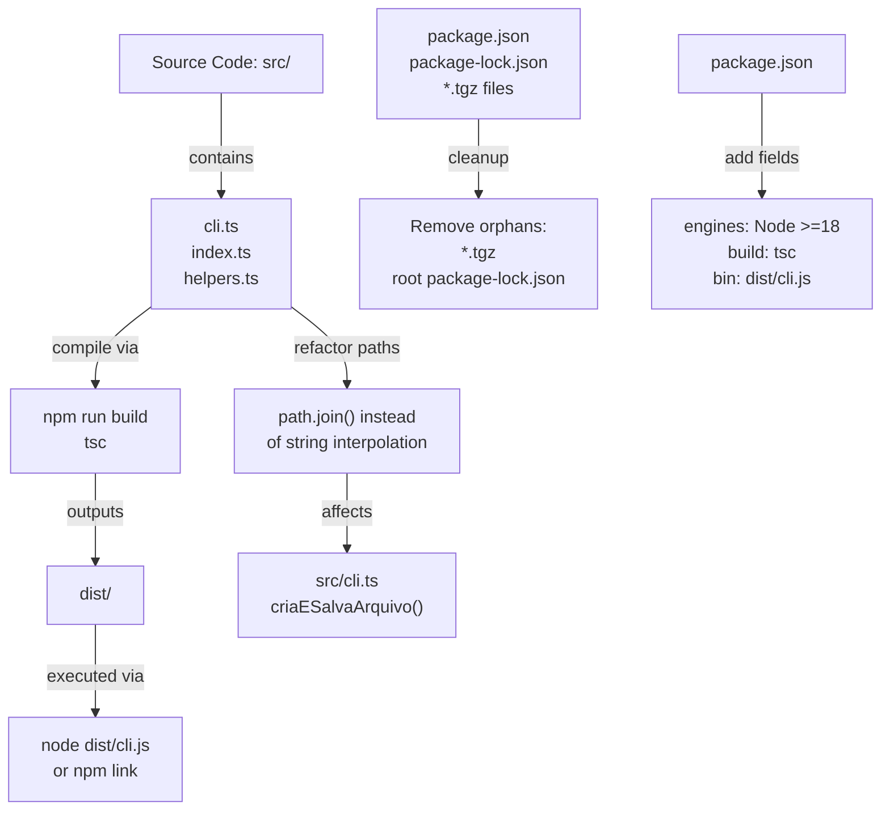

# Project Infrastructure Design

**Spec**: `.specs/features/project-infra/spec.md`  
**Status**: Draft  
**Last Updated**: 2026-04-10

---

## Architecture Overview

M2 establishes professional build and distribution infrastructure for the text-analyzer-cli. The solution adds TypeScript compilation (tsc), updates package.json configuration, removes orphan artifacts, and replaces string interpolation with portable path construction.



**Key Changes**:
1. **Build pipeline**: TypeScript → JavaScript (dist/)
2. **Package metadata**: Node version requirement + executable configuration
3. **Artifact cleanup**: Remove stale tarballs and parent package-lock.json
4. **Portable paths**: Replace string templates with path.join()

---

## Code Reuse Analysis

### Existing Components to Leverage

| Component | Location | How to Use |
|-----------|----------|-----------|
| `fs.promises` | `src/cli.ts` | Already using for file I/O; paths will be constructed with path.join() |
| `path` module | `src/cli.ts` (already imported) | Import path.join() for all path construction |
| Error handling | `src/erros/funcoesErro.ts` | Existing error handling remains unchanged |
| CLI structure | `src/cli.ts` | Commander.js program structure preserved |

### Integration Points

| System | Integration Method |
|--------|-------------------|
| TypeScript compiler | `tsc` via npm script (no code changes) |
| Node.js runtime | engines field + dist/ output for portability |
| Package.json bin field | Points to dist/cli.js after build (no changes to source code) |

---

## Components & File Modifications

### C1: Package Configuration

- **Purpose**: Define Node.js version requirement, build command, and executable entry point
- **Location**: `PrimeiraBiblioteca/package.json`
- **Changes**:
  - Add `"engines": { "node": ">=18" }` — enforce minimum Node 18
  - Add `"build": "tsc"` — compile TypeScript to dist/
  - Add `"bin": { "text-analyzer-cli": "dist/cli.js" }` — executable entry for npm link
- **Rationale**: Ensures CLI can be installed globally and specifies Node version compatibility

### C2: TypeScript Configuration

- **Purpose**: Specify compilation output directory
- **Location**: `PrimeiraBiblioteca/tsconfig.json`
- **Changes**:
  - Add `"outDir": "dist"` in `compilerOptions` — output compiled JS to dist/ 
  - Keep existing targets (Node16, es2020, strict: true)
- **Dependencies**: Already uses src/**/* includes
- **Rationale**: dist/ is standard for compiled output; enables clean builds

### C3: Path Construction Refactor

- **Purpose**: Replace string interpolation with portable path.join()
- **Location**: `src/cli.ts` function `criaESalvaArquivo()`
- **Current Code**:
  ```typescript
  const arquivoNovo = `${endereco}/resultado.txt`;
  ```
- **Target Code**:
  ```typescript
  const arquivoNovo = path.join(endereco, 'resultado.txt');
  ```
- **Dependencies**: `path` module (already imported)
- **Rationale**: path.join() handles OS-specific separators (/ vs \); fixes Windows compatibility

### C4: Artifact Cleanup

- **Purpose**: Remove orphan files
- **Locations**:
  - `PrimeiraBiblioteca/typescript-eslint-eslint-plugin-6.21.0.tgz` (DELETE)
  - `PrimeiraBiblioteca/package-lock.json` (DELETE if at root; real one is in PrimeiraBiblioteca/)
- **Rationale**: Clean repository state; prevents confusion about dependencies

---

## Data Models

None — this is infrastructure setup, not domain data.

---

## Error Handling Strategy

| Error Scenario | Handling | User Impact |
|---|---|---|
| TypeScript compilation fails (tsc error) | npm run build exits with non-zero code | User sees error message; build fails |
| npm link fails (Node version mismatch) | engines field prevents installation on Node <18 | Clear npm error: "Node version not supported" |
| Path construction on Windows | path.join() auto-handles separators | No errors; file created in correct location |
| File write fails in criaESalvaArquivo() | Existing error handling in validaEntrada() catches it | User sees trataErros() message |

---

## Tech Decisions

| Decision | Choice | Rationale |
|----------|--------|-----------|
| Output directory name | `dist/` | Industry standard; clean separation of source and compiled code |
| Node version requirement | `>=18` | Current LTS; supports ES2020 + ESM modules |
| Build command | `tsc` without flags | Uses tsconfig.json defaults; simple, reproducible |
| Path construction | `path.join()` | Cross-platform; handles edge cases (trailing slashes, ..) |
| bin field value | `dist/cli.js` | Post-compilation; npm link installs compiled version |

---

## Gate Checks & Verification

| Check | Command | Expected Result |
|-------|---------|-----------------|
| TypeScript compilation | `npm run build` | Exits 0; creates dist/cli.js |
| CLI functionality | `node dist/cli.js --texto arquivos/texto-kanban.txt --destino resultados` | Should equal ts-node version |
| Package install | `npm install` | Completes without orphan file conflicts |
| Unit + lint tests | `npm test && npm run lint && npm typecheck` | All pass (25/25 tests, 0 lint errors) |

---

## Implementation Notes

- **tsconfig.json update**: Add only `"outDir": "dist"` to compilerOptions; no other changes
- **Path refactoring**: Single location (criaESalvaArquivo); path module already imported
- **.gitignore**: Already created in M0; verify dist/ and *.tgz are included
- **Before vs. After**: After build, `npm link` makes `text-analyzer-cli` command available globally
